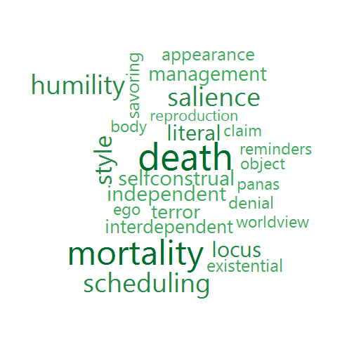
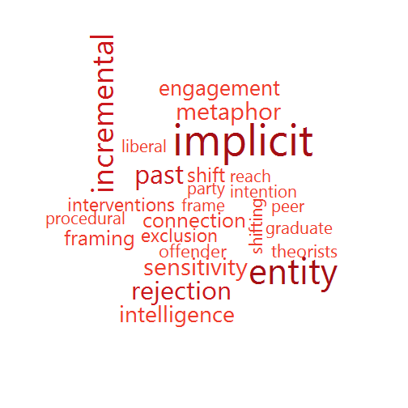
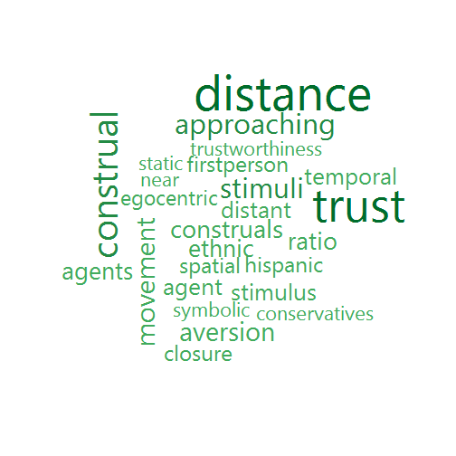

Analyses to empirically identify the contents of communities of scholarship in JPSP based on text analysis.


```r
library (tm)
```

```
## Loading required package: NLP
```

```r
library (wordcloud)
```

```
## Loading required package: RColorBrewer
```

```r
library(VennDiagram)
```

```
## Loading required package: grid
```

```r
# library(png)
library (slam)
# library (RColorBrewer)

# Source of PDFs
source <- "C:/Users/the/Dropbox/2 Social Psych structure/textanalysisofcommunities"
texts  <- "C:/Users/the/Dropbox/2 Social Psych structure/textanalysisofcommunities/text"

# dir.create(file.path(corpus), showWarnings = FALSE)
# make a vector of PDF file names
myfiles <- list.files(path = source, pattern = "pdf",  full.names = TRUE)
# remove spaces from filenames
sapply(myfiles, FUN = function(i){
  file.rename(from = i, to =  paste0(dirname(i), "/", gsub(" ", "", basename(i))))
})
```

```
## C:/Users/the/Dropbox/2 Social Psych structure/textanalysisofcommunities/pdf-txtdone 
##                                                                                TRUE
```

```r
# get the PDF file names without spaces
myfiles <- list.files(path = source, pattern = "pdf",  full.names = TRUE)

# commented out here -runs interactively in R but not Rmd
############### PDF to TXT (Ben Marwick) ########################
#lapply(myfiles, function(i) system(paste
#          ('"C:/Program Files (x86)/xpdfbin-win-3.04/bin64/pdftotext.exe"', paste0('"', i, '"')), wait = FALSE) )
mytext <- list.files(path = source, pattern = "txt",  full.names = TRUE)

# copy text files to subdirectory then delete from original directory
sapply(mytext, FUN = function(i){
        file.copy(from = i, to = paste0(texts,"/", basename (i)))
        })
```

```
## C:/Users/the/Dropbox/2 Social Psych structure/textanalysisofcommunities/pdf-txtdone 
##                                                                               FALSE
```

```r
#file.remove(mytext)
```

There are eight separate corpora here, each corresponding to a separate community.


```r
text1  <- "C:/Users/the/Dropbox/2 Social Psych structure/textanalysisofcommunities/text/comm1"
text2  <- "C:/Users/the/Dropbox/2 Social Psych structure/textanalysisofcommunities/text/comm2"
text3  <- "C:/Users/the/Dropbox/2 Social Psych structure/textanalysisofcommunities/text/comm3"
text4  <- "C:/Users/the/Dropbox/2 Social Psych structure/textanalysisofcommunities/text/comm4"
text5  <- "C:/Users/the/Dropbox/2 Social Psych structure/textanalysisofcommunities/text/comm5"
text6  <- "C:/Users/the/Dropbox/2 Social Psych structure/textanalysisofcommunities/text/comm6"
text7  <- "C:/Users/the/Dropbox/2 Social Psych structure/textanalysisofcommunities/text/comm7"
text0  <- "C:/Users/the/Dropbox/2 Social Psych structure/textanalysisofcommunities/text/comm0"
```

The corpora are cleaned in tm. In addition to removing common stopwords, I also parse terms which are judged to be non-discrimintating. These include terms which describe sections of papers (e.g., *Abstract*), numbers (*four*), etc.

This is done for all eight files.


```r
toSpace <- content_transformer(function(x, pattern) gsub(pattern, " ", x))
initials <- c("a","b","c","d","e","f","g","h","i","j","k","l","m",
              "n","o","p","q","r","s","t","u","v","w","x","y","z")   
myStopWords <- c("address","addressed","analyses","analysis","article","based","bulletin","case","combined",
"complete","completed","completing","conclusion","conclusions","control","copyrighted",
"data","describe","described","describing","description","descriptions","discussion","disseminated",
"doi","dxdoiorg","effect","effects","email","estimate","estimated","estimates","figure",
"findings","first","five","followed","following","found","four","half","handbook","high","include",
"included","including","involved","issue","issues","journal","less","level","literature","low","main",
"measure","note","one","ones","original","overall","participant","participants","power","procedure",
"psychological","psychology","publishers","reported","research","results","sample","samples","second",
"show","showed","showing","shown","shows","six","size","studies","study","support","table","third",
"three","two","university","variable","variables","various","year","zero")

# 7 as well as others
docs <- Corpus(DirSource(text7))

docs <- tm_map(docs, content_transformer(tolower))
docs <- tm_map(docs, toSpace,"/|@|\\|")
docs <- tm_map(docs, removeNumbers)
docs <- tm_map(docs, removePunctuation)
docs <- tm_map(docs, stripWhitespace)
docs <- tm_map(docs, removeWords, stopwords("english"))
docs <- tm_map(docs, removeWords, initials)
docs <- tm_map(docs, removeWords, myStopWords)

# 7 replaced here too
dtm7 <- DocumentTermMatrix(docs)
```

The eight files are combined into six summary files: A single matrix of frequencies, then a second with proportions, each based on all terms.  Then two additional files, each based on words which appear at least 10 times in the whole corpus.  Finally, two files which center along both rows and columns: These provide the differential words.


```r
freq0 <- as.data.frame(col_sums (dtm0))
freq1 <- as.data.frame(col_sums (dtm1))
freq2 <- as.data.frame(col_sums (dtm2))
freq3 <- as.data.frame(col_sums (dtm3))
freq4 <- as.data.frame(col_sums (dtm4))
freq5 <- as.data.frame(col_sums (dtm5))
freq6 <- as.data.frame(col_sums (dtm6))
freq7 <- as.data.frame(col_sums (dtm7))

a <-merge(freq0,freq1, by="row.names", all = TRUE)
b <- freq2

## Following routine avoids "duplicate row.name" error for multiple merges
res <- Reduce(function(a,b){
        ans <- merge(a,b,by="row.names",all=T)
        row.names(ans) <- ans[,"Row.names"]
        ans[,!names(ans) %in% "Row.names"]
        }, list(freq0,freq1,freq2))
a <- res
b <- freq3
res <- Reduce(function(a,b){
        ans <- merge(a,b,by="row.names",all=T)
        row.names(ans) <- ans[,"Row.names"]
        ans[,!names(ans) %in% "Row.names"]
        }, list(freq0,freq1,freq2, freq3))
a <- res
b <- freq4
res <- Reduce(function(a,b){
        ans <- merge(a,b,by="row.names",all=T)
        row.names(ans) <- ans[,"Row.names"]
        ans[,!names(ans) %in% "Row.names"]
        }, list(freq0,freq1,freq2, freq3,freq4))
a <- res
b <- freq5
res <- Reduce(function(a,b){
        ans <- merge(a,b,by="row.names",all=T)
        row.names(ans) <- ans[,"Row.names"]
        ans[,!names(ans) %in% "Row.names"]
        }, list(freq0,freq1,freq2, freq3,freq4,freq5))
a <- res
b <- freq6
res <- Reduce(function(a,b){
        ans <- merge(a,b,by="row.names",all=T)
        row.names(ans) <- ans[,"Row.names"]
        ans[,!names(ans) %in% "Row.names"]
        }, list(freq0,freq1,freq2, freq3,freq4,freq5,freq6))
a <- res
b <- freq7
alltext <- Reduce(function(a,b){
        ans <- merge(a,b,by="row.names",all=T)
        row.names(ans) <- ans[,"Row.names"]
        ans[,!names(ans) %in% "Row.names"]
        }, list(freq0,freq1,freq2, freq3,freq4,freq5,freq6,freq7))

alltext[is.na(alltext)] <- 0
names(alltext) <- c("sumc0","sumc1","sumc2","sumc3","sumc4","sumc5","sumc6","sumc7")

alltextm <- addmargins(as.matrix(alltext))
alltextm <- as.data.frame(alltextm)
attach(alltextm)
allpct <- scale(alltext)
allrelfreq <- t(scale (t(allpct)))
head(allrelfreq)
```

```
##                sumc0      sumc1      sumc2      sumc3      sumc4
## aaaaaargh -0.6353401 -0.8703168 -0.4988565  1.5823278 0.80695679
## aacting   -0.7576832 -1.0130218  1.3145119  0.2665745 0.80959561
## aaker     -0.5661144 -0.6416199 -0.5222578 -0.2632338 1.77057125
## aaq       -0.5957242 -0.7718619 -0.4934165  2.0224350 0.48541683
## aaroe     -0.5786512 -0.6816991 -0.5187969 -0.1652876 0.05386142
## aaron     -0.5661144 -0.6416199 -0.5222578 -0.2632338 1.77057125
##                sumc5     sumc6      sumc7
## aaaaaargh -0.7774907 1.1327057 -0.7399862
## aacting   -0.9121519 1.1635722 -0.8713974
## aaker     -0.6117919 1.4341871 -0.5997405
## aaq       -0.7022798 0.7295971 -0.6741665
## aaroe     -0.6409907 0.1967171  2.3348471
## aaron     -0.6117919 1.4341871 -0.5997405
```

```r
allrfm <- addmargins(as.matrix(allrelfreq))

# including only terms which appear n or more times in sum of all corpora

mosttext <- subset(alltextm, Sum > 9)
mosttext <- mosttext[1:6042,1:8] # remove the column and row sums I just added
mostpct <- scale(mosttext)
mostrelfreq <-t(scale (t(mostpct)))
mostrfm<- addmargins(as.matrix(mostrelfreq))

write.csv(allpct,     "allpct.csv")
write.csv(allrelfreq, "allrelfreq.csv")
write.csv(alltext,    "alltext.csv")
write.csv(allrfm,     "allrfm.csv")
write.csv(mostpct,    "mostpct.csv")
write.csv(mostrelfreq,"mostrelfreq.csv")
write.csv(mosttext,   "mosttext.csv")
write.csv(mostrfm,    "mostrfm.csv")
```

I then constructed wordclouds to describe the unique content of each of the eight communities.  This was done by extracting the double-centered matrix of terms used at least five times (mostrelfreq), then removing words which were included in only one of the communities - these were typically highly specialized terms, proper names, and acronyms such as hexacohh (for the HEXACO Honesty-Humility scale).  I then sorted the matrix by each of the eight communities and removed other proper names that appeared in the top 60 terms ranked by relative frequency. Finally, I returned a sorted matrix of words and raw values for the top 50 terms in each category.

Colors are extracted from the Brewer palettes. 
Using the dark end of one of the Brewer palettes as light end is too faint
A limitation: both the size of the word and the intensity of the color describe the same parameter (frequency)


```r
blues <- c("#F7FBFF", "#DEEBF7", "#C6DBEF", "#9ECAE1" ,"#6BAED6", "#4292C6", "#2171B5","#08519C","#08306B")
purples <- c("#FCFBFD" ,"#EFEDF5", "#DADAEB", "#BCBDDC", "#9E9AC8", "#807DBA","#6A51A3","#54278F","#3F007D")
reds <- c("#FFF5F0","#FEE0D2","#FCBBA1","#FC9272","#FB6A4A","#EF3B2C","#CB181D","#A50F15","#67000D")
oranges <- c("#FFF5EB","#FEE6CE","#FDD0A2","#FDAE6B" ,"#FD8D3C", "#F16913" ,"#D94801", "#A63603", "#7F2704")
greens <- c("#F7FCF5","#E5F5E0","#C7E9C0","#A1D99B","#74C476","#41AB5D","#238B45","#006D2C","#00441B")
greys <- c( "#FFFFFF", "#F0F0F0" ,"#D9D9D9", "#BDBDBD" ,"#969696", "#737373", "#525252" ,"#252525","#000000")

windowsFonts(
  Segoe=windowsFont("Segoe UI"),
  Corbel=windowsFont("Corbel"),
  Cambria=windowsFont("Cambria"),
  Candara=windowsFont("Candara"),
  Times=windowsFont("Times New Roman"),
  Trebuchet=windowsFont("Trebuchet")
)
par(bg=greys[1], family="Segoe")
set.seed(92134)
wordcloud(t1$X,t1$countc1, scale = c(4.5,1.5), max.words = 25,colors = greens[c(6,7,8)],rot.per = .2)
```

 

```r
set.seed(92134)
wordcloud(t2$X,t2$countc2, scale = c(4.5,1.5), max.words = 25,colors = reds[c(6,7,8)],rot.per = .2)
```

 

```r
set.seed(92134)
wordcloud(t3$X,t3$countc3, scale = c(4.5,1.5), max.words = 25,colors = purples[c(6,7,8)],rot.per = .2)
```

 

```r
set.seed(92134)
wordcloud(t4$X,t4$countc4, scale =c(4.5,1.5), max.words = 25,colors = blues[c(6,7,8)],rot.per = .2)
```

 

```r
set.seed(92134)
wordcloud(t5$X,t5$countc5, scale =c(4.5,1.5), max.words = 25,colors = greens[c(6,7,8)],rot.per = .2)
```

 

```r
set.seed(92134)
wordcloud(t6$X,t6$countc6, scale = c(4.5,1.5), max.words = 25,colors = oranges[c(6,7,8)],rot.per = .2)
```

 

```r
set.seed(92134)
wordcloud(t7$X,t7$countc7, scale = c(4.5,1.5), max.words = 25,colors = reds[c(6,7,8)],rot.per = .2)
```

 

```r
set.seed(92134)
wordcloud(t0$X,t0$countc0, scale = c(4.5,1.5), max.words = 25,colors = greens[c(6,7,8)],rot.per = .2)
```

 


